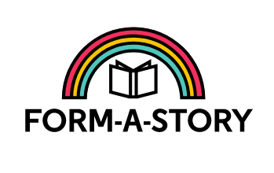

# Form A Story
> A story generator using user input. Practice Project from Codecademy.

## Table of Contents
- [Form A Story](#form-a-story)
  - [Table of Contents](#table-of-contents)
  - [General Information](#general-information)
  - [Technologies Used](#technologies-used)
  - [Features](#features)
  - [Screenshots](#screenshots)
  - [Setup](#setup)
  - [Usage](#usage)
  - [Project Status](#project-status)
  - [Room for Improvement](#room-for-improvement)
  - [Acknowledgements](#acknowledgements)
  - [Contact](#contact)
  - [License](#license)
<!-- * [License](#license) -->

## General Information
- A story is generated everytime the user inputs information to this personalized program.
- Project Objectives:
    * Use HTML forms and validation
    * Build interactive websites with JavaScript
    * Git, command line, and local development
- This is a practice project to show basic HTML Forms, JS commands and version control skills
- The purpose of this project is to put some practice on HTML Forms. 
- I started this project following the Codecademy's Full Stack Path and practice my programming skills.

## Technologies Used
- HTML
- JavaScript
- Git and GitHub
- Command line

## Features
- Story Generator

## Screenshots

_Image provided on the code by Codecademy._

## Setup
No special setup for this project. Just type some info in the input data fields and enjoy.

## Usage
You can open the page in this [link](https://mikheltodd.github.io/Form-A-Story/)

## Project Status
Project is: _in progress_ 

## Room for Improvement

Provide options for different stories and suggest words for more coherent stories.

Room for improvement:
- Test with different stories. 

To do:
- Pending.

## Acknowledgements

- This project was inspired by Codecademy
- This project was based on <a href="https://www.codecademy.com/paths/full-stack-engineer-career-path/tracks/fscp-building-interactive-websites-with-javascript/modules/fecp-html-forms/projects/form-a-story" target="_blank">this tutorial</a>
- Many thanks to Codecademy.

## Contact
Created by <a href="https://github.com/Mikheltodd" target="_blank">@Mikheltodd</a> - feel free to contact me!

## License
This project is open source.
